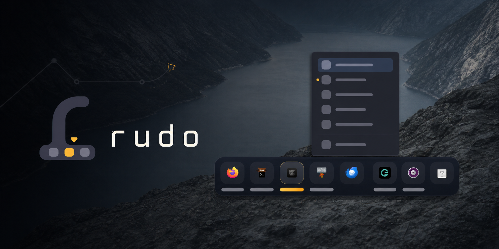

# rudo



A small, elegant dock for Wayland.

`rudo` is built for a clean desktop: pinned apps, live running windows, gentle autohide, and simple user configuration. It is designed to feel at home on `niri`, while still working with other Wayland compositors that expose the right protocols.

<details>
  <summary>Features</summary>

- Wayland-first dock UI with GTK4 + layer-shell
- Persistent pinned apps
- Running window tracking
- Launch feedback to prevent double-click spam
- **Configurable menu system** — power menu, custom actions, confirmations
- **Multi-monitor placement** — show the dock on the first or every connected output
- Manual `--toggle`, `--show`, and `--hide` commands
- Optional autohide with hover-to-reveal
- User theming via CSS
- Live-reloading behavior settings via JSON

</details>

## Compositor Support

- `niri`: best experience, using `NIRI_SOCKET` integration
- Other Wayland compositors: works through `wlr-foreign-toplevel-management` when available

<details>
  <summary>Feature Availability by Backend</summary>

| Feature | niri | wlr-foreign-toplevel |
|---------|------|---------------------|
| Window tracking | ✅ Full | ✅ Full |
| Activation/close | ✅ Full | ✅ Full |

</details>

## Build

```sh
cargo build --release
```

Or with `just`:

```sh
just build
```

## Run

```sh
cargo run --release
```

Or:

```sh
just run
```

Running `rudo` again shows the existing dock instead of creating another one. Visibility can be
controlled from scripts or compositor key bindings:

```sh
rudo --toggle
rudo --show
rudo --hide
```

## Install
### From AUR (Arch Linux)
For Arch Linux users, `rudo` is available in the AUR as `rudo-bin`:
```bash
yay -S rudo-bin
# or
paru -S rudo-bin
```
This installs the pre-built binary. No compilation needed.

## Configuration

`rudo` stores its user files in `~/.config/rudo/`.

- `pins.json`: pinned applications
- `settings.json`: behavior settings
- `style.css`: visual overrides

Default `settings.json`:

```json
{
  "autohide": {
    "enabled": true,
    "delay_secs": 3
  },
  "show_pin_button": true,
  "icon_size": 24,
  "position": "bottom",
  "outputs": "first",
  "animation_duration_ms": 220,
  "menu": {
    "enabled": false,
    "icon": "system-lock-screen-symbolic",
    "position": "end",
    "items": [
      {"label": "Lock", "icon": "system-lock-screen-symbolic", "command": "swaylock -f", "confirm": false},
      {"label": "Logout", "icon": "system-log-out-symbolic", "command": "loginctl terminate-user $USER", "confirm": true},
      {"label": "Restart", "icon": "system-restart-symbolic", "command": "systemctl reboot", "confirm": true},
      {"label": "Shutdown", "icon": "system-shutdown-symbolic", "command": "systemctl poweroff", "confirm": true}
    ]
  }
}
```

- **position**: `"bottom"`, `"top"`, `"left"`, `"right"`
- **outputs**: `"first"` for one dock or `"all"` for one dock on every connected monitor
- **icon_size**: Size in pixels (default: 24)
- **animation_duration_ms**: Show/hide animation in milliseconds (default: 220)

Settings and monitor changes are applied while Rudo is running. Every dock view shares the same
pins and global window list; filtering windows by their current output is not yet supported by the
available backends.

<details>
  <summary>Menu System</summary>

Configure a power menu or custom actions via the `menu` section:

- **enabled**: Show/hide the menu button
- **icon**: Icon name for the menu button (default: `system-lock-screen-symbolic`)
- **position**: `"start"` (before pins) or `"end"` (after running apps)
- **items**: Array of menu items with `label`, `command`, optional `icon`, and `confirm` flag

Set `confirm: true` to show a confirmation dialog before executing destructive commands.
</details>

`style.css` is loaded on every start after the built-in theme, so you can override the dock without rebuilding.

## Autostart (niri)

The GitHub release archive includes `rudo.service`. The `rudo-bin` AUR package installs it as a
systemd user unit, but leaves activation to the user. Enable and start it with:

```sh
systemctl --user enable --now rudo.service
```

If you installed Rudo manually from the release archive, install the binary and unit first:

```sh
sudo install -Dm755 rudo /usr/local/bin/rudo
install -Dm644 rudo.service ~/.config/systemd/user/rudo.service
systemctl --user daemon-reload
systemctl --user enable --now rudo.service
```

Niri starts `graphical-session.target`, which starts Rudo and stops it again with the graphical
session. Remove any existing `spawn-at-startup "rudo"` entry before enabling the service.

Alternatively, add Rudo directly to your niri config:

```kdl
// ~/.config/niri/config.kdl
spawn-at-startup "rudo"

binds {
    Mod+D { spawn "rudo" "--toggle"; }
}
```

## Development

```sh
just fmt
just check
```

## Status

`rudo` is intentionally small. The codebase is structured to stay easy to change as more dock behavior is added over time.
