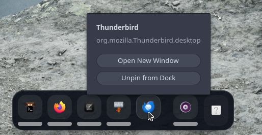

# rudo



A small, elegant dock for Wayland.

`rudo` is built for a clean desktop: pinned apps, live running windows, gentle autohide, and simple user configuration. It is designed to feel at home on `niri`, while still working with other Wayland compositors that expose the right protocols.

## Features

- Wayland-first dock UI with GTK4 + layer-shell
- Persistent pinned apps
- Running window tracking
- Launch feedback to prevent double-click spam
- **Badge notifications** — unread counts from apps (Discord, Telegram, etc.)
- **Configurable menu system** — power menu, custom actions, confirmations
- **Output-based grouping** — group and order windows by monitor/screen
- Optional autohide with hover-to-reveal
- User theming via CSS
- User behavior settings via JSON

## Compositor Support

- `niri`: best experience, using `NIRI_SOCKET` integration
- Other Wayland compositors: works through `wlr-foreign-toplevel-management` when available

<details>
  <summary>Feature Availability by Backend</summary>

| Feature | niri | wlr-foreign-toplevel |
|---------|------|---------------------|
| Window tracking | ✅ Full | ✅ Full |
| Activation/close | ✅ Full | ✅ Full |
| Badge notifications | ❌ Not yet | ⚠️ Limited* |
| Output grouping | ❌ Not yet | ⚠️ Limited* |

\* Badge notifications and output grouping depend on compositor-specific protocol extensions. Most compositors don't currently provide badge counts or window coordinates through the standard protocol.

</details>

## Build

```sh
cargo build --release
```

Or with `just`:

```sh
just build
```

## Run

```sh
cargo run --release
```

Or:

```sh
just run
```

## Install
### From AUR (Arch Linux)
For Arch Linux users, `rudo` is available in the AUR as `rudo-bin`:
```bash
yay -S rudo-bin
# or
paru -S rudo-bin
```
This installs the pre-built binary. No compilation needed.

## Configuration

`rudo` stores its user files in `~/.config/rudo/`.

- `pins.json`: pinned applications
- `settings.json`: behavior settings
- `style.css`: visual overrides

Default `settings.json`:

```json
{
  "autohide": {
    "enabled": true,
    "delay_secs": 3
  },
  "show_pin_button": true,
  "icon_size": 24,
  "position": "bottom",
  "animation_duration_ms": 220,
  "menu": {
    "enabled": true,
    "icon": "system-shutdown-symbolic",
    "position": "end",
    "items": [
      {"label": "Lock", "icon": "system-lock-screen-symbolic", "command": "loginctl lock-session", "confirm": false},
      {"label": "Logout", "icon": "system-log-out-symbolic", "command": "loginctl terminate-user $USER", "confirm": true},
      {"label": "Restart", "icon": "system-restart-symbolic", "command": "systemctl reboot", "confirm": true},
      {"label": "Shutdown", "icon": "system-shutdown-symbolic", "command": "systemctl poweroff", "confirm": true}
    ]
  },
  "group_by_output": false
}
```

- **position**: `"bottom"`, `"top"`, `"left"`, `"right"` (requires restart)
- **icon_size**: Size in pixels (default: 24)
- **animation_duration_ms**: Show/hide animation in milliseconds (default: 220)

<details>
  <summary>Menu System</summary>

Configure a power menu or custom actions via the `menu` section:

- **enabled**: Show/hide the menu button
- **icon**: Icon name for the menu button (default: `system-shutdown-symbolic`)
- **position**: `"start"` (before pins) or `"end"` (after running apps)
- **items**: Array of menu items with `label`, `command`, optional `icon`, and `confirm` flag

Set `confirm: true` to show a confirmation dialog before executing destructive commands.
</details>

<details>
  <summary>Output-Based Window Grouping</summary>

When `group_by_output: true`, windows are grouped by the monitor they're displayed on, and sorted by their spatial coordinates (top-to-bottom, left-to-right). This helps organize docks in multi-monitor setups.

**Note**: This feature requires compositor support for providing output information and window coordinates via the `wlr-foreign-toplevel-management` protocol. Currently most compositors don't provide this data.

</details>

<details>
  <summary>Badge Notifications</summary>

When supported by your compositor, rudo displays unread notification counts (badges) on dock items from apps like Discord, Telegram, etc. Badge counts are aggregated across all windows of the same app.

- Zero-count badges are automatically hidden
- Counts above 99 display as "99+"
- Red badge with white text for visibility

`style.css` is loaded on every start after the built-in theme, so you can override the dock without rebuilding.

</details>

## Development

```sh
just fmt
just check
```

## Status

`rudo` is intentionally small. The codebase is structured to stay easy to change as more dock behavior is added over time.
